# 🚀 **Java DevOps CI/CD Project** – *End-to-End Automation on AWS*

  
   
  <em>CI/CD Pipeline Architecture Diagram</em>

---

## **Project Overview**

This project demonstrates a fully automated DevOps pipeline for deploying a **Java web application**.

### Tools used:
- 🧱 Built with Maven & Docker
- 🔄 Integrated CI/CD via Jenkins
- 📦 Containerized and pushed to Docker Hub
- ☁️ Deployed on AWS EC2 using Ansible
- 🧩 Infrastructure provisioned using Terraform

🔗 **Live Demo:**  
http://<webserver_eip>:8080/jpetstore

---

## **Infrastructure Provisioning** *(Terraform + AWS)*

Two EC2 instances are provisioned:
- `jenkins-ec2` – for Jenkins  
- `webserver-ec2` – for hosting the Java web app  
- Security Group: SSH (22) & HTTP (80) access  
- Elastic IPs assigned to both instances

  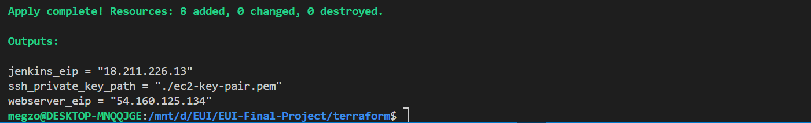
   
  <em>Terraform: Infrastructure successfully provisioned</em>

  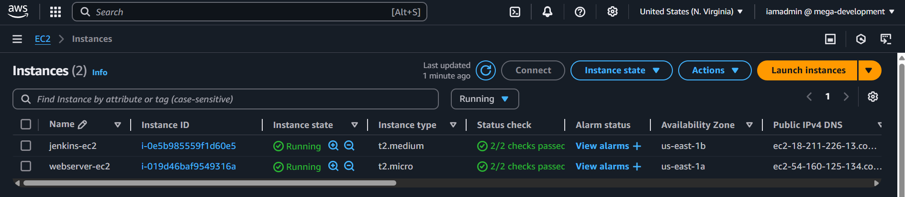
   
  <em>EC2 Instances shown in AWS Console</em>

  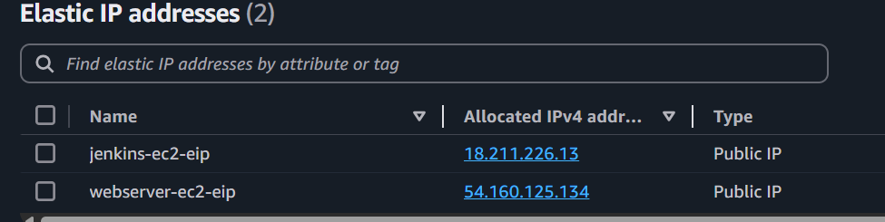
   
  <em>Elastic IP addresses associated with instances</em>

  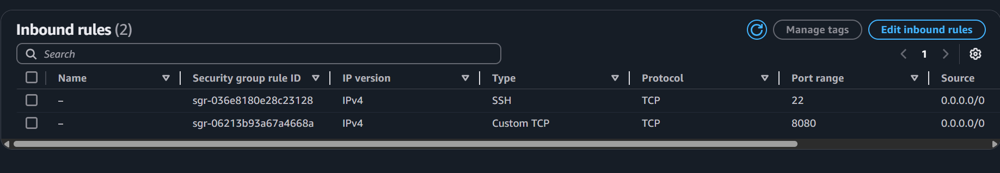
   
  <em>Security Group allows inbound SSH and HTTP traffic</em>

---

## **Jenkins Server Setup**

Configured via `jenkins-userdata.sh` during provisioning. Installs:
- Java  
- Jenkins  
- Maven  
- Docker  
- Ansible  

  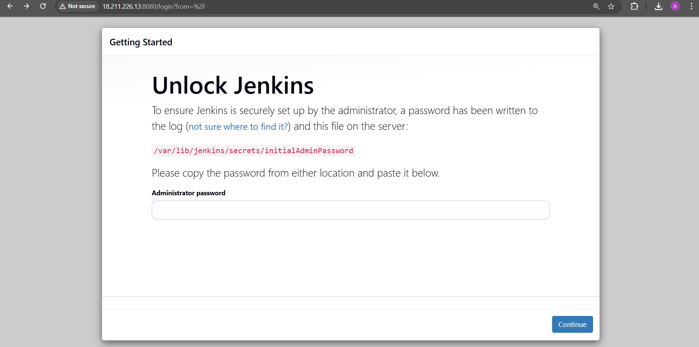
   
  <em>Jenkins running on EC2: <code>http://&lt;jenkins_eip&gt;:8080</code></em>

  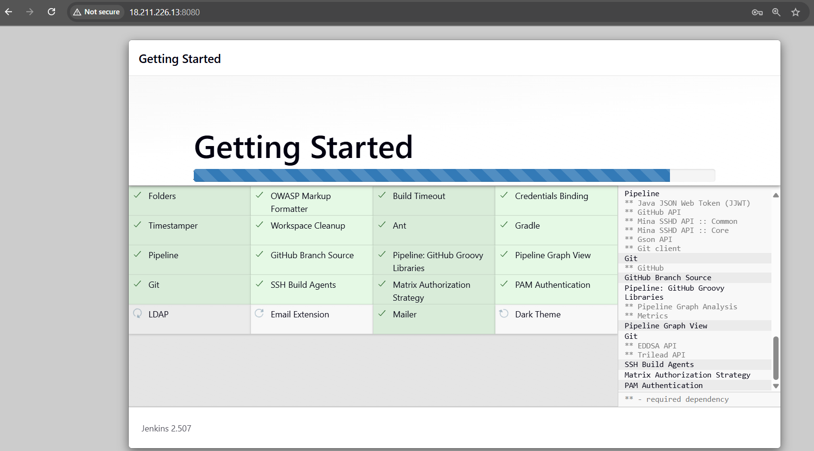
   
  <em>Jenkins Initial Setup Wizard</em>

  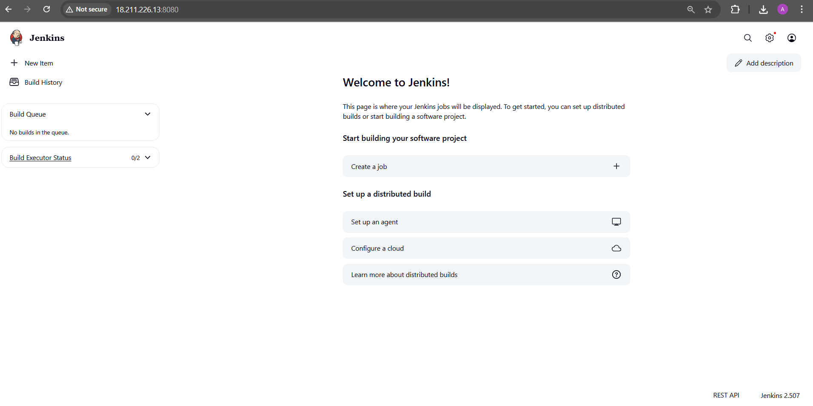
   
  <em>Jenkins Dashboard after setup</em>

---

## **GitHub to Jenkins Integration**

A GitHub webhook is set up to trigger builds on every push to the `main` branch.

  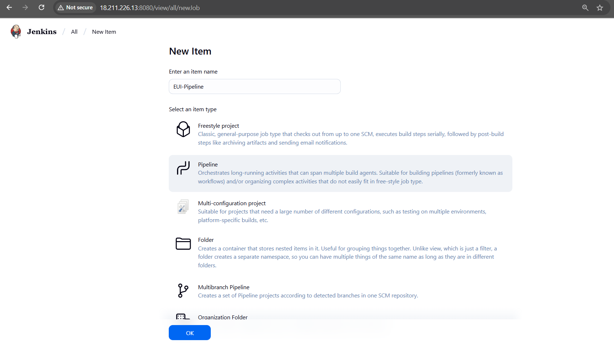
   
  <em>Creating a new Pipeline job: <code>EUI-Pipeline</code></em>

  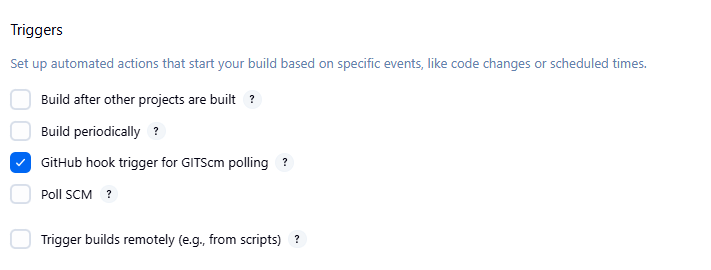
   
  <em>Configuring SCM polling to auto-trigger builds</em>

  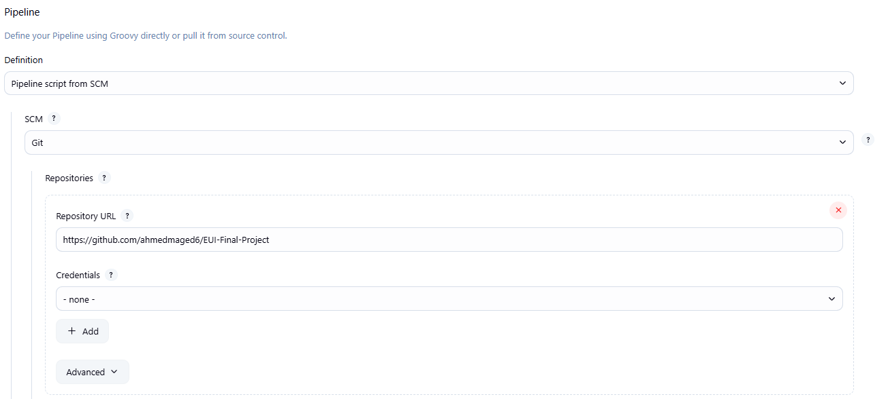
   
  <em>Linking to GitHub repo using Jenkinsfile</em>

  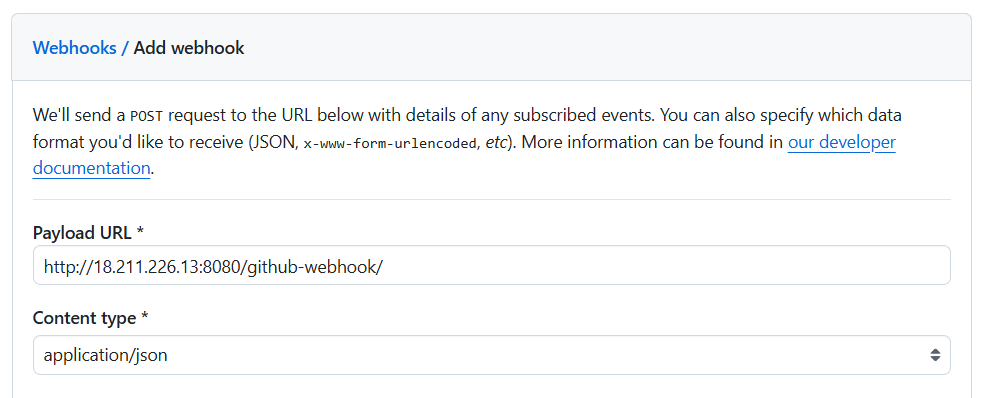
   
  <em>GitHub Webhook to notify Jenkins</em>

---

## **Jenkins CI/CD Pipeline**

### Continuous Integration (CI)

1. **Clone Repository**  
2. **Setup Maven Wrapper**  
3. **Build with** `./mvnw clean package`  

  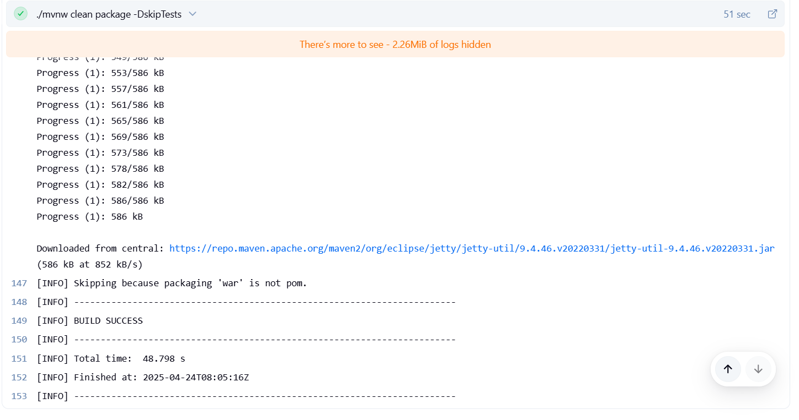
   
  <em>Java app compiled into a WAR file</em>

4. **Run Unit Tests**  

  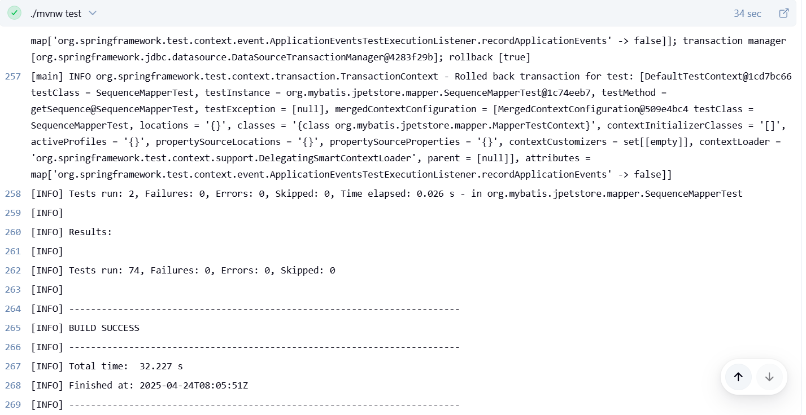
   
  <em>Maven runs automated unit tests</em>

5. **Dockerize Application**  

  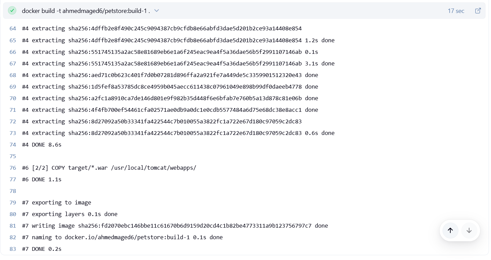
   
  <em>Docker image built from the WAR file</em>

6. **Push Docker Image to Docker Hub**  

  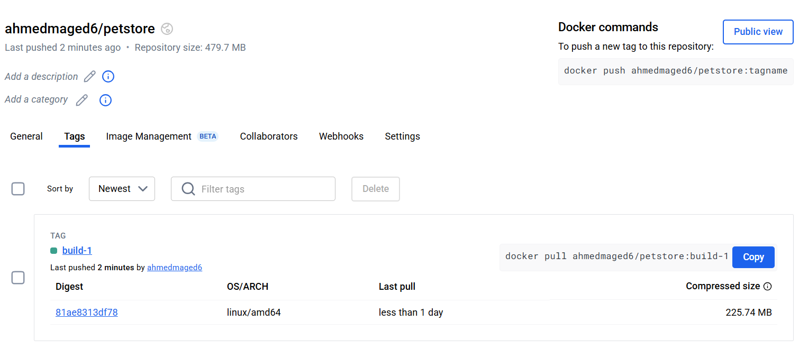
   
  <em>Image pushed to Docker Hub</em>

---

### Continuous Deployment (CD)

7. **Deploy via Ansible**  

  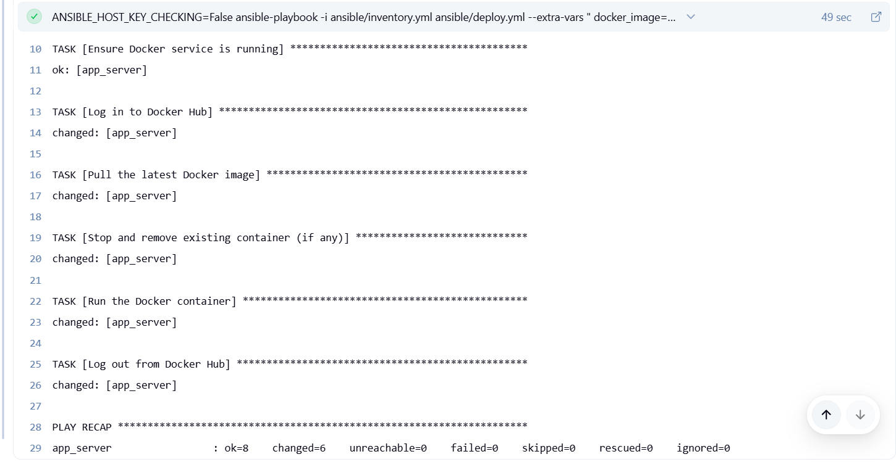
   
  <em>App deployed to webserver EC2 via Ansible</em>

8. **App Running on EC2 Webserver**  

  
   
  <em>jPetStore available at <code>http://&lt;webserver_eip&gt;:8080/jpetstore</code></em>

---

